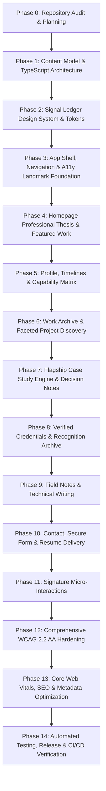

# Project Plan: Evidence-First IT Undergraduate Portfolio ("Signal Ledger")

> **Document Status:** Active Baseline (Phase 0 Audit Complete)  
> **Target Persona:** IT Undergraduate / Emerging Software & Systems Engineer  
> **Design Constitution:** Signal Ledger (Technical Editorial, Warm Paper/Ink, Cobalt Signal, Grid Logic)  
> **Core Principle:** Absolute truthfulness — zero invented metrics, credentials, outcomes, or experiences.

---

## 1. Executive Summary & Vision

The objective is to architect and deliver a high-end, production-grade personal portfolio website that positions an IT undergraduate as a rigorous, credible, and thoughtful emerging engineer. 

Rather than adopting generic AI template aesthetics (neon purple blobs, floating 3D spheres, glassmorphism, percentage skill bars, and ungrounded buzzwords), this portfolio functions as an **Authoritative Professional Evidence System**. Every claim is anchored in verified technical artifacts, architectural diagrams, decision records, debugging narratives, and structured case studies.

---

## 2. Design Constitution: "Signal Ledger"

| Design Dimension | Specification |
|---|---|
| **Aesthetic Concept** | Technical editorial publication + engineering notebook + modern product craft |
| **Surface (Base)** | **Bone Paper** (`#F2EFE8`) — warm, distinctive tactile tone |
| **Ink (Text/Dark)** | **Mineral Ink** (`#171A1D`) — crisp, deep charcoal text and high-contrast dark plates |
| **Primary Signal** | **Signal Cobalt** (`#2F5BFF`) — links, interactive focus, primary actions |
| **Rare Highlight 1** | **Lab Chartreuse** (`#C9F24A`) — status indicators, active stamps, subtle callouts |
| **Rare Highlight 2** | **Oxide** (`#C45B43`) — secondary warnings, debugging badges, human warmth |
| **Rule / Muted** | **Steel** (`#8C949C`) — structural grid rules, hairline borders, metadata labels |
| **Typography System** | Editorial Display Serif/Sans for landmark titles + Grotesk Sans for UI/Body + Monospace for metadata, code, timestamps, and indexing |
| **Layout & Grid** | Visible 12-column desktop / 6-column tablet / 4-column mobile grid with rule lines, section indices (`01 / INDEX`), and controlled asymmetry |
| **Motion Standard** | 150–250ms functional transitions; strict `prefers-reduced-motion` compliance; zero scroll-jacking or floating background particles |

---

## 3. Phased Implementation Roadmap

### Phase Details & Quality Gates

#### **Phase 0 — Repository Audit & Project Constitution (COMPLETE)**
- **Scope:** Inspect repo, establish baseline, identify anti-patterns, propose architecture, draft project plan & content gap checklist.
- **Deliverables:** `PROJECT_PLAN.md`, `implementation_plan.md`, verified repository baseline.
- **Quality Gate:** Strict alignment with anti-AI template guidelines and zero invented content. (Passed)

#### **Phase 1 — Content Model & Information Architecture (COMPLETE)**
- **Scope:** Define robust TypeScript interfaces and validation helpers for Profile, Education, Experience, Capabilities, Projects, DecisionNotes, EvidenceLinks, Credentials, and Notes. Populate with neutral placeholder structures.
- **Deliverables:** `content/types/*.ts`, `content/*.data.ts`, `lib/content/*.ts`, `lib/content/validator.ts`, `app/*`.
- **Quality Gate:** `npm run typecheck` passes with zero `any` types; content editing requires zero JSX modifications. (Passed)

#### **Phase 2 — Design Tokens & "Signal Ledger" Visual System (COMPLETE)**
- **Scope:** Establish CSS variables for colors, typography scale, responsive grid, spacing units, hairline borders, and focus rings. Build core primitives (`Container`, `Section`, `Grid`, `Rule`, `Eyebrow`, `MetadataList`, `StatusStamp`, `EvidenceLink`, `Stack`, `Cluster`). Specimen route at `/dev/design-system`.
- **Deliverables:** `styles/tokens.css`, `styles/globals.css`, `components/ui/*`, `app/dev/design-system/page.tsx`.
- **Quality Gate:** 100% contrast compliance for text/background tokens; responsive fluid typography. (Passed)

#### **Phase 3 — App Shell, Navigation & Layout Landmarks (COMPLETE)**
- **Scope:** Implement semantic header, editorial desktop navigation, accessible mobile drawer, skip-to-content link, footer with colophon and availability status.
- **Deliverables:** `components/layout/*`, `lib/navigation.ts`, `app/layout.tsx`.
- **Quality Gate:** Full keyboard accessibility (Tab, Shift+Tab, Escape), active route styling, zero focus traps. (Passed)

#### **Phase 4 — Homepage: Professional Thesis & Selected Proof**
- **Scope:** Build the homepage argument: Opening Thesis Panel, 2–3 Flagship Project Plates, Capability Map, Current Focus ("Now/Learning"), Education/Experience snapshot, Selected Credentials, and Contact Close.
- **Deliverables:** `app/page.tsx`, `components/home/*`.
- **Quality Gate:** Distinctive identity without boilerplate "Hi, I'm a passionate developer" clichés; legible without animation.

#### **Phase 5 — Profile Page: Education, Experience & Capability Matrix**
- **Scope:** Comprehensive About page with long bio, responsive education timeline, experience timeline with evidence-driven bullets, capability matrix linked to projects, and personal operating principles.
- **Deliverables:** `app/profile/page.tsx`, `components/profile/*`.
- **Quality Gate:** Zero self-rated percentage bars or star ratings; dates formatted clearly; mobile-optimized timeline layout.

#### **Phase 6 — Work Index & Project Discovery**
- **Scope:** Filterable project catalog with category filtering, status badges (`shipped`, `active`, `experimental`, `archived`), metadata summaries, and zero layout shift.
- **Deliverables:** `app/work/page.tsx`, `components/work/*`.
- **Quality Gate:** Filter states accessible via keyboard and screen readers; handles empty states gracefully.

#### **Phase 7 — Project Case-Study Template (The Credibility Engine)**
- **Scope:** Dynamic case-study route (`/work/[slug]`) adhering to: *Context → Problem → Constraints → Role → Decisions → Implementation → Quality (Testing/Security/A11y/Perf) → Outcomes → Lessons → v2*.
- **Deliverables:** `app/work/[slug]/page.tsx`, `components/project/*` (`ProjectHero`, `ProjectFacts`, `DecisionNote`, `ArchitectureFigure`, `BuildLog`, `ArtifactDrawer`, `ProjectPager`).
- **Quality Gate:** Deep technical reasoning highlighted; text alternatives for all diagrams; zero fluff.

#### **Phase 8 — Credentials, Awards & Hackathon Proof**
- **Scope:** Verified credentials archive featuring top certifications, academic honors, hackathons, and open-source contributions with outbound verification links.
- **Deliverables:** `app/credentials/page.tsx`, `components/credentials/*`.
- **Quality Gate:** Verified links use safe rel attributes (`rel="noopener noreferrer"`); sensitive IDs masked.

#### **Phase 9 — Field Notes & Technical Writing (Optional/Extensible)**
- **Scope:** Lab notes and debugging postmortems architecture with code block syntax highlighting, reading time, and related project links.
- **Deliverables:** `app/notes/page.tsx`, `app/notes/[slug]/page.tsx`, `components/notes/*`.
- **Quality Gate:** Code blocks meet AA contrast; zero fake placeholder articles published.

#### **Phase 10 — Contact, Resume & Conversion**
- **Scope:** Contact hub with availability indicator, direct email, verified social profiles, accessible form with honeypot/validation, and secure resume view/download.
- **Deliverables:** `app/contact/page.tsx`, `components/contact/*`, `public/documents/resume.pdf`.
- **Quality Gate:** Form validation announces errors accessibly; email fallback provided.

#### **Phase 11 — Signature Restrained Interactions**
- **Scope:** 2–3 tasteful interactions: Case-study reading progress rail, artifact drawer toggle, capability-to-project highlight.
- **Deliverables:** Micro-interactions in `components/*`.
- **Quality Gate:** 100% operable with animations disabled (`prefers-reduced-motion: reduce`).

#### **Phase 12 — Comprehensive Accessibility Hardening**
- **Scope:** Rigorous WCAG 2.2 AA audit covering heading hierarchy, color contrast ratios, screen reader labels, keyboard focus management, and sticky navigation offset.
- **Deliverables:** Automated a11y tests, accessibility statement.
- **Quality Gate:** Zero automated a11y violations (axe-core / Lighthouse a11y = 100).

#### **Phase 13 — Core Web Vitals, SEO & Metadata Optimization**
- **Scope:** Open Graph images, JSON-LD structured data (`Person`, `SoftwareSourceCode`), dynamic sitemap, robots.txt, image optimization with explicit dimensions, font subsetting.
- **Deliverables:** `app/sitemap.ts`, `app/robots.ts`, Open Graph assets.
- **Quality Gate:** LCP ≤ 2.5s, INP ≤ 200ms, CLS ≤ 0.1 on mobile throttling.

#### **Phase 14 — Automated Testing, Release & CI/CD**
- **Scope:** Smoke tests for navigation, filters, case studies, and form validation; GitHub Actions workflow for linting, typechecking, and build validation.
- **Deliverables:** `.github/workflows/ci.yml`, test suites.
- **Quality Gate:** All tests and builds pass cleanly on clean checkout.

---

## 4. Content Dependency Matrix & Owner Gaps

| Section | Required Owner Information | Fallback Strategy | Status |
|---|---|---|---|
| **Identity** | Full Name, Professional Title, 1-Sentence Thesis, Bio | Neutral bracketed placeholder `[YOUR NAME]` | Pending Owner Input |
| **Contact** | Public Email, GitHub URL, LinkedIn URL, Location | `[email@example.com]`, placeholder URLs | Pending Owner Input |
| **Education** | University, Degree Program, Graduation Year, Coursework | `[University Name]`, `[B.S. in Information Technology]` | Pending Owner Input |
| **Flagship 1** | Capstone / Major Project (Architecture, Decisions, Repo, Demo) | Standardized structured case study template with TODO markers | Pending Owner Input |
| **Flagship 2** | Full-Stack / Cloud / Systems Project (Role, Tradeoffs, Code) | Standardized structured case study template with TODO markers | Pending Owner Input |
| **Flagship 3** | Team Project / Research / Tooling Project (Debugging narrative) | Standardized structured case study template with TODO markers | Pending Owner Input |
| **Capabilities** | Primary Languages, Frameworks, Cloud, Databases, Tools | Grouped capability taxonomy linked to project tags | Drafted Schema |
| **Credentials** | Verified Certificates, Hackathons, Academic Awards, URLs | Structured credential schema with verification placeholders | Drafted Schema |
| **Resume** | PDF Resume file | Structured placeholder file in `public/documents/` | Pending File Upload |

---

## 5. Technical Risk Register

| Risk ID | Description | Impact | Mitigation Strategy |
|---|---|---|---|
| **TR-01** | Over-reliance on heavy client JS bundles | High (LCP/INP degradation) | Use Next.js React Server Components by default; isolate client hooks (`"use client"`) only to interactive components. |
| **TR-02** | Layout shift (CLS) from fonts and responsive images | Medium (CLS failure) | Preload critical font subsets; declare explicit `width` and `height` (or aspect-ratio containers) for all images. |
| **TR-03** | Inaccessible custom filters / navigation | High (A11y violation) | Use semantic HTML `<button>`, proper `aria-pressed` / `aria-expanded`, and native focus management. |
| **TR-04** | Content coupling to presentation components | High (Maintenance drag) | Enforce typed single-source-of-truth content modules (`content/*.ts`); components receive pure props. |
| **TR-05** | Accidental publication of unverified / placeholder claims | Critical (Credibility damage) | Prominent development warnings and a pre-build script that audits unpopulated bracketed markers before production deployment. |

---

## 6. Phase 1 Execution Plan

### Objective
Establish the foundational type system, content schemas, validation mechanisms, and structured data modules without writing presentation UI.

### Planned Files for Phase 1:
1. `package.json` & `tsconfig.json`: Next.js 14+ / React 18+ / TypeScript strict environment.
2. `content/types/content.types.ts`: Core data structures (Status, Category, Technology, EvidenceLink).
3. `content/types/profile.types.ts`: Profile, Education, Experience, Capability, OperatingPrinciple schemas.
4. `content/types/project.types.ts`: Comprehensive Project schema including Problem, Constraints, Role, Decisions, Quality, and Outcomes.
5. `content/types/credential.types.ts`: Credential, Award, and Hackathon schemas.
6. `content/types/note.types.ts`: Field Notes and technical writing schemas.
7. `content/profile.data.ts`: Structured profile data with explicit placeholders.
8. `content/education.data.ts`: Structured academic records with explicit placeholders.
9. `content/experience.data.ts`: Structured professional/internship records.
10. `content/skills.data.ts`: Evidence-linked capability groups.
11. `content/projects.data.ts`: 2–3 flagship + 2 secondary structured project templates.
12. `content/credentials.data.ts`: Structured credential and recognition items.
13. `lib/content/projects.service.ts`: Query functions (`getFeaturedProjects`, `getProjectBySlug`, `getProjectsByCategory`).
14. `lib/content/content.service.ts`: Unified content loaders and validation helpers.
15. `content/README.md`: Clear documentation instructing the portfolio owner on how to safely populate real data.
